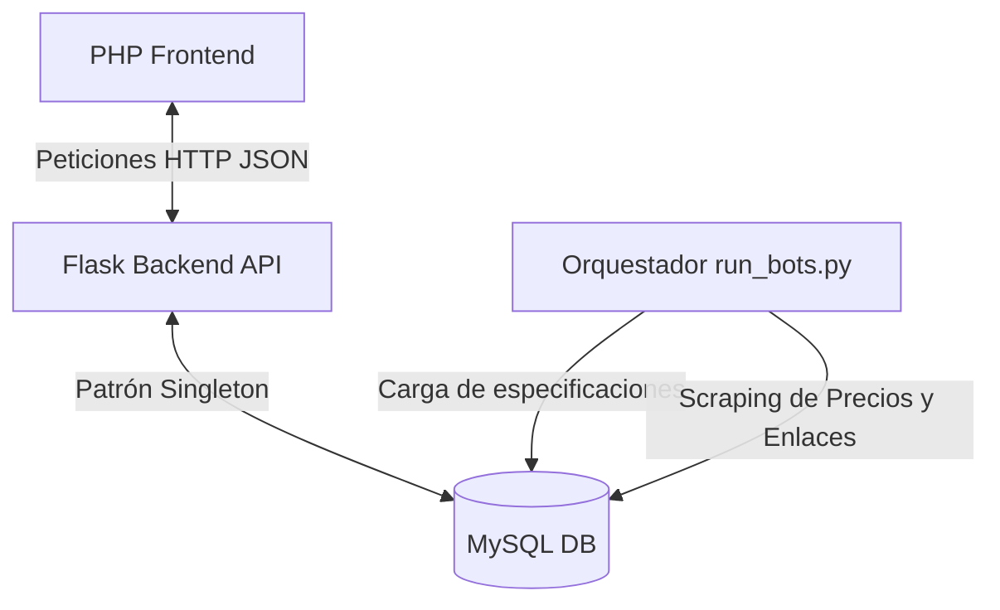

# 💻 TechMatch - Sistema de Comparación de Hardware

TechMatch es una plataforma relacional avanzada para la comparación de hardware de computación y laptops. El sistema utiliza **bots de web scraping** automáticos con Selenium y BeautifulSoup para recopilar especificaciones técnicas de fabricantes y precios reales de retailers locales, consolidando la información en un modelo de datos estructurado que habilita recomendaciones inteligentes y comparaciones homogéneas basadas en perfiles de uso.

---

## 🚀 Características Clave

* 📊 **Catálogo General y Especializado**: Clasificación dinámica de productos en múltiples categorías: **Laptops**, **CPUs**, **GPUs**, **Memorias RAM** y **Almacenamiento (SSD/SSD NVMe/HDD)**.
* 🤖 **Ingesta y Validación Estricta**: Filtros avanzados en la capa de base de datos que descartan de forma automática registros incompletos (como laptops sin CPU definida) o productos incorrectos (como consolas clasificadas como procesadores).
* 🧠 **Comparador Inteligente por Perfiles**: Puntuación y recomendación automatizada en base a perfiles de uso:
  * 🎮 **Gaming**: Prioriza frecuencias altas, memoria VRAM de GPUs y latencia baja.
  * 💻 **Desarrollo de Software**: Prioriza núcleos/hilos de CPU y cantidad de RAM.
  * 💼 **Ofimática/Productividad**: Prioriza consumo energético eficiente (bajo TDP) y discos rápidos.
  * 🎨 **Diseño Gráfico / Creación**: Prioriza una mezcla equilibrada de RAM, núcleos y VRAM.
* 🏬 **Mapeo de Múltiples Tiendas (N:M)**: Monitoreo de precios, urls y disponibilidad en retailers reconocidos como *Compra Gamer* y *Mercado Libre*.
* 👤 **Área de Usuarios**: Registro seguro, inicio de sesión (contraseñas hasheadas con `bcrypt`), gestión de favoritos y registro histórico de comparaciones guardadas.

---

## 🏗️ Arquitectura del Sistema

La solución está separada en capas limpias e independientes:



### 1. Frontend (Cliente)
Desarrollado en **PHP** con Vanilla CSS y JavaScript dinámico. Interactúa de forma asíncrona con el backend:
* **Catálogo interactivo** con filtrado por categoría, perfil de uso y buscador textual.
* **Ficha de detalle** especializada por categoría mostrando especificaciones completas y el comparador de precios por tienda.
* **Gestión de Sesión segura** persistida de forma nativa en PHP.

### 2. Backend (API REST)
Construido en **Python con Flask** y organizado según una arquitectura en capas:
* **Controlador (`app.py`)**: Define las rutas HTTP y gestiona las solicitudes entrantes.
* **Servicios (`servicios/`)**: Contiene la lógica de negocio (reglas de comparación, autenticación y favoritos).
* **DAO (`dao/`)**: Capa de persistencia dedicada. Implementa consultas seguras a MySQL para las 18 tablas del sistema.
* **Modelos (`modelos/`)**: Representa las entidades de datos (Laptop, CPU, GPU, RAM, Almacenamiento, Usuario, etc.).

### 3. Motor de Scraping (Bots)
Automatización orquestada por `run_bots.py` dividida en tres fases secuenciales:
1. **Fabricantes de Laptops**: Extrae especificaciones reales y dimensiones físicas directamente desde los portales de *ASUS* y *Lenovo (PSREF)*.
2. **Fabricantes de Componentes**: Carga características técnicas avanzadas de CPUs oficiales desde los portales de *AMD* e *Intel*.
3. **Retailers**: Busca precios e imágenes en *Compra Gamer* y *Mercado Libre*, vinculándolos a los modelos del catálogo oficial y mapeando especificaciones sobre la marcha para componentes nuevos mediante expresiones regulares en `normalizacion.py`.

---

## 📂 Estructura del Directorio Principal

```text
TechMatch/
├── backend/                       # API REST y Automatización de Scraping
│   ├── app.py                     # Punto de entrada de la API Flask
│   ├── config.py                  # Parámetros del sistema y credenciales de BD
│   ├── run_bots.py                # Orquestador del scraping diario
│   ├── Requerimientos.txt         # Dependencias del backend Python
│   ├── dao/                       # Capa exclusiva de Acceso a Datos (MySQL)
│   ├── database/                  # Manejo de conexión única (Singleton)
│   ├── modelos/                   # Clases de dominio de hardware y usuario
│   ├── scrapers/                  # Scripts de web scraping (Selenium y bs4)
│   ├── servicios/                 # Lógica de negocio (comparación, auth, etc.)
│   └── utils/                     # Normalización de títulos y validación cruzada
├── frontend/                      # Cliente web
│   ├── index.php                  # Página principal de bienvenida
│   ├── catalogo.php               # Grilla de productos con filtros
│   ├── detalle_producto.php       # Ficha técnica y ofertas de compra
│   ├── comparar.php               # Comparador lado a lado con veredicto
│   ├── componentes/               # Navbar, footer y product cards reutilizables
│   └── assets/                    # Hojas de estilo y controladores JavaScript (api.js, etc.)
└── sql/                           # Scripts SQL de estructura e inicialización
```

---

## ⚙️ Instalación y Configuración

### 1. Base de Datos (MySQL)
1. Crea una base de datos vacía llamada `techmatch`.
2. Importa el esquema completo del proyecto:
   ```bash
   mysql -u tu_usuario -p techmatch < sql/techmatch.sql
   ```
3. Opcionalmente, importa datos iniciales de soporte si necesitas refrescar marcas y categorías:
   ```bash
   mysql -u tu_usuario -p techmatch < sql/crear_tablas_nuevas.sql
   ```

### 2. Backend (Flask API)
1. Navega al directorio backend:
   ```bash
   cd backend
   ```
2. Crea un entorno virtual e instala las dependencias:
   ```bash
   python -m venv venv
   # En Windows
   venv\Scripts\activate
   # En Linux / macOS
   source venv/bin/activate

   pip install -r Requerimientos.txt
   ```
3. Revisa la configuración de conexión en [config.py](file:///x:/backend/config.py) (puedes ajustar el host, puerto, usuario y contraseña de MySQL).
4. Ejecuta el servidor Flask:
   ```bash
   python app.py
   ```
   *La API correrá por defecto en `http://localhost:5000`.*

### 3. Frontend (PHP)
1. Copia o enlaza la carpeta `frontend/` al directorio raíz de tu servidor Apache/Nginx (por ejemplo, `www/` en Laragon o `htdocs/` en XAMPP).
2. Asegúrate de configurar la URL de tu API backend Flask en [config/api.php](file:///x:/frontend/config/api.php).

---

## 🤖 Ejecución del Scraping e Ingesta

Para actualizar precios y poblar nuevos componentes, ejecuta el orquestador principal:

```bash
cd backend
python run_bots.py
```

### Automatización en Servidor (Cron Job)
Para que el catálogo se actualice automáticamente en segundo plano todas las noches a las **3:00 AM**, se incluye el script autoinstalable [setup_cron.sh](file:///x:/setup_cron.sh). Para configurarlo, dale permisos y ejecútalo en el entorno Linux de producción:

```bash
chmod +x setup_cron.sh
./setup_cron.sh
```

---

## 📡 Endpoints de la API REST

### Autenticación
* `POST /api/register`: Registra un nuevo usuario (`email_usuario`, `pass_usuario`, `nombre_usuario`).
* `POST /api/login`: Inicia sesión devolviendo información del usuario.

### Catálogo y Filtros
* `GET /api/productos`: Lista de productos filtrados.
  * *Parámetros opcionales*: `categoria` (Laptop, CPU, GPU, RAM, Almacenamiento), `perfil` (Gaming, Desarrollo, Ofimatica, Diseno), `busqueda` (texto libre).
* `GET /api/productos/<int:id>`: Detalle extendido de un producto específico, incluyendo sus características técnicas específicas por categoría y la lista de precios por tienda.

### Comparación y Favoritos
* `GET /api/comparar`: Compara dos productos de la misma categoría.
  * *Parámetros obligatorios*: `idA` (ID producto 1), `idB` (ID producto 2), `perfil` (Perfil de uso de referencia).
* `GET /api/favoritos`: Recupera los productos marcados como favoritos por el usuario actual.
* `POST /api/favoritos`: Agrega o remueve un producto de favoritos.
