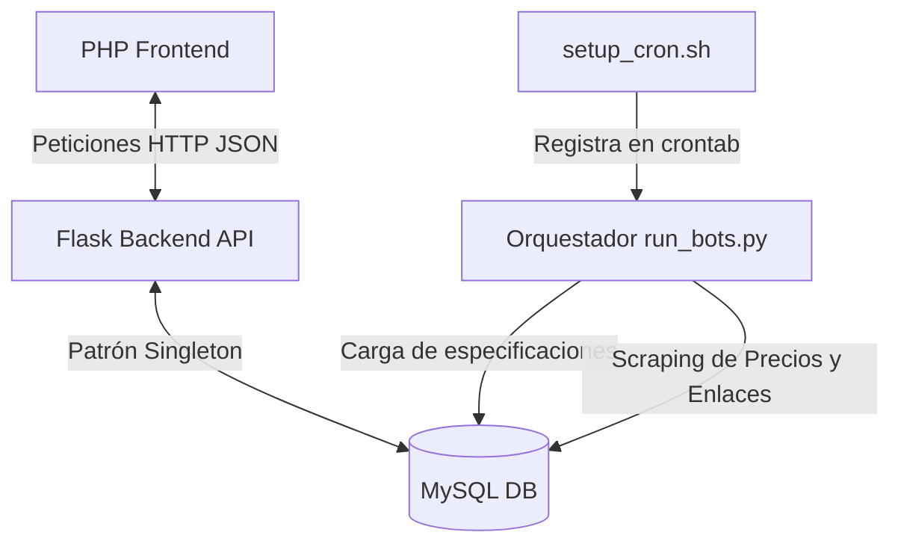

# 💻 TechMatch - Sistema de Comparación de Hardware

TechMatch es una plataforma relacional avanzada para la comparación de hardware de computación y laptops. El sistema utiliza **bots de web scraping** automáticos con Selenium y BeautifulSoup para recopilar especificaciones técnicas de fabricantes y precios reales de retailers locales, consolidando la información en un modelo de datos estructurado que habilita recomendaciones inteligentes y comparaciones homogéneas basadas en perfiles de uso.

---

## 🚀 Características Clave

* 📊 **Catálogo General y Especializado**: Clasificación dinámica de productos en múltiples categorías: **Laptops**, **CPUs**, **GPUs**, **Memorias RAM** y **Almacenamiento (SSD/SSD NVMe/HDD)**.
* 🤖 **Ingesta y Validación Estricta**: Filtros avanzados en la capa de base de datos que descartan de forma automática registros incompletos (como laptops sin CPU definida) o productos incorrectos (como consolas clasificadas como procesadores).
* 🧠 **Comparador Inteligente por Perfiles**: Puntuación y recomendación automatizada en base a perfiles de uso:
  * 🎮 **Gaming**: Prioriza frecuencias altas, memoria VRAM de GPUs y latencia baja.
  * 💻 **Desarrollo de Software**: Prioriza núcleos/hilos de CPU y cantidad de RAM.
  * 💼 **Ofimática/Productividad**: Prioriza consumo energético eficiente (bajo TDP) y discos rápidos.
  * 🎨 **Diseño Gráfico / Creación**: Prioriza una mezcla equilibrada de RAM, núcleos y VRAM.
* 🏬 **Mapeo de Múltiples Tiendas (N:M)**: Monitoreo de precios, urls y disponibilidad en retailers reconocidos como *Compra Gamer* y *Mercado Libre*.
* 👤 **Área de Usuarios**: Registro seguro, inicio de sesión flexible (por email o usuario con contraseñas hasheadas con `bcrypt`), y gestión de perfil.
* 🔑 **Recuperación de Contraseña Avanzada**: Flujo seguro mediante código OTP (One-Time Password) de 6 dígitos enviado por correo electrónico con expiración automática, temporizador de reenvío de 60 segundos y validación de seguridad de la nueva clave.
* 💾 **Historial de Comparaciones**: Posibilidad de guardar comparaciones técnicas realizadas, consultar el veredicto en base a perfiles y gestionar el historial (listar y eliminar registros guardados).
* 💖 **Gestión de Favoritos**: Marcado rápido de componentes de interés para fácil acceso desde el panel de usuario.
* ⏰ **Automatización Nocturna**: Script `setup_cron.sh` que configura un cron job para ejecutar los bots automáticamente cada noche a las 3:00 AM.

---

## 🏗️ Arquitectura del Sistema

La solución está separada en capas limpias e independientes:



### 1. Frontend (Cliente)
Desarrollado en **PHP** con Vanilla CSS y JavaScript dinámico. Interactúa de forma asíncrona con el backend:
* **Catálogo interactivo** con filtrado por categoría, perfil de uso y buscador textual.
* **Ficha de detalle** especializada por categoría mostrando especificaciones completas y el comparador de precios por tienda.
* **Comparador dinámico** (`comparar.php`): Comparación técnica lado a lado con recomendación inteligente y la opción de guardar la comparación de manera permanente.
* **Mis Comparaciones** (`comparaciones_guardadas.php`): Panel exclusivo para usuarios registrados que muestra el historial de comparaciones y permite revivirlas o eliminarlas.
* **Recuperación de Contraseña** (`recuperar.php`): Interfaz visual guiada paso a paso (OTP de 6 dígitos y cambio de contraseña con indicador de fortaleza).
* **Gestión de Sesión segura** centralizada en `utils/` y persistida de forma nativa en PHP.

### 2. Backend (API REST)
Construido en **Python con Flask** y organizado según una arquitectura en capas:
* **Controlador (`app.py`)**: Define las rutas HTTP y gestiona las solicitudes entrantes.
* **Servicios (`servicios/`)**: Contiene la lógica de negocio (reglas de comparación, autenticación, envío de email y favoritos).
* **DAO (`dao/`)**: Capa de persistencia dedicada. Implementa consultas seguras a MySQL para las 18 tablas del sistema.
* **Modelos (`modelos/`)**: Representa las entidades de datos (Laptop, CPU, GPU, RAM, Almacenamiento, Usuario, etc.).
* **Utils (`utils/`)**: Módulo de normalización de datos scrapeados para su correcta inserción en la base de datos.

### 3. Motor de Scraping (Bots)
Automatización orquestada por `run_bots.py` dividida en tres fases secuenciales:
1. **Fabricantes de Laptops**: Extrae especificaciones reales y dimensiones físicas directamente desde los portales de *ASUS* y *Lenovo (PSREF)*.
2. **Fabricantes de Componentes**: Carga características técnicas avanzadas de CPUs oficiales desde los portales de *AMD* e *Intel*.
3. **Retailers**: Busca precios e imágenes en *Compra Gamer* y *Mercado Libre*, vinculándolos a los modelos del catálogo oficial y mapeando especificaciones sobre la marcha para componentes nuevos mediante expresiones regulares en `normalizacion.py`.

---

## 📂 Estructura del Directorio Principal

```text
TechMatch/
├── setup_cron.sh                  # Script de configuración automática del cron job
├── backend/                       # API REST y Automatización de Scraping
│   ├── app.py                     # Punto de entrada de la API Flask
│   ├── config.py                  # Parámetros del sistema y credenciales de BD
│   ├── run_bots.py                # Orquestador del scraping diario
│   ├── Requerimientos.txt         # Dependencias del backend Python
│   ├── dao/                       # Capa exclusiva de Acceso a Datos (MySQL)
│   │   ├── categoria_dao.py       # Consultas de categorías de productos
│   │   ├── comparacion_dao.py     # Consultas de comparaciones guardadas
│   │   ├── favorito_dao.py        # Consultas de productos favoritos
│   │   ├── marca_dao.py           # Consultas de marcas registradas
│   │   ├── perfil_uso_dao.py      # Consultas de perfiles de uso
│   │   ├── producto_dao.py        # Consultas principales de catálogo y detalle
│   │   ├── recuperacion_dao.py    # Consultas del flujo OTP de recuperación
│   │   ├── tienda_dao.py          # Consultas de tiendas y precios
│   │   └── usuario_dao.py         # Consultas de usuarios y autenticación
│   ├── database/                  # Manejo de conexión única (Singleton)
│   ├── modelos/                   # Clases de dominio de hardware y usuario
│   │   ├── almacenamiento.py      # Entidad SSD/HDD
│   │   ├── categoria.py           # Entidad Categoría
│   │   ├── comparacion_guardada.py # Entidad historial de comparaciones
│   │   ├── cpu.py                 # Entidad CPU
│   │   ├── gpu.py                 # Entidad GPU
│   │   ├── laptop.py              # Entidad Laptop
│   │   ├── marca.py               # Entidad Marca
│   │   ├── perfil_uso.py          # Entidad Perfil de Uso
│   │   ├── producto.py            # Entidad base Producto
│   │   ├── ram.py                 # Entidad RAM
│   │   ├── tienda.py              # Entidad Tienda
│   │   └── usuario.py             # Entidad Usuario
│   ├── scrapers/                  # Scripts de web scraping (Selenium y bs4)
│   │   ├── scraper_base.py        # Clase base con lógica compartida de scraping
│   │   ├── scrapers_fabricantes.py # Scraping de especificaciones de laptops (ASUS, Lenovo)
│   │   ├── scrapers_componentes.py # Scraping de CPUs desde AMD e Intel
│   │   ├── scrapers_especificaciones.py # Extracción de especificaciones técnicas detalladas
│   │   ├── recuperador_precios.py # Scraping de precios en retailers (Compra Gamer, ML)
│   │   └── scraper_imagenes.py    # Scraping y descarga de imágenes de productos
│   ├── servicios/                 # Lógica de negocio
│   │   ├── auth_servicio.py       # Autenticación: registro, login y validación de usuarios
│   │   ├── comparacion_servicio.py # Motor de comparación y puntuación por perfiles
│   │   ├── email_servicio.py      # Envío de emails con código OTP para recuperación
│   │   ├── favorito_servicio.py   # Lógica de gestión de favoritos
│   │   └── producto_servicio.py   # Lógica de consulta y filtrado del catálogo
│   └── utils/                     # Normalización de títulos y validación cruzada
│       └── normalizacion.py       # Expresiones regulares para mapeo de especificaciones
├── frontend/                      # Cliente web
│   ├── index.php                  # Página principal de bienvenida
│   ├── catalogo.php               # Grilla de productos con filtros
│   ├── detalle_producto.php       # Ficha técnica y ofertas de compra
│   ├── comparar.php               # Comparador lado a lado con veredicto y opción de guardar
│   ├── comparaciones_guardadas.php # Panel con el historial de comparaciones del usuario
│   ├── favoritos.php              # Listado de productos marcados como favoritos
│   ├── recuperar.php              # Interfaz de recuperación de contraseña (OTP)
│   ├── login.php                  # Inicio de sesión seguro
│   ├── registro.php               # Registro de nuevos usuarios
│   ├── componentes/               # Navbar, footer y product cards reutilizables
│   │   ├── navbar.php             # Barra de navegación con estado de sesión dinámico
│   │   └── footer.php             # Pie de página del sitio
│   ├── config/
│   │   └── api.php                # URL centralizada del backend Flask
│   ├── utils/                     # Helpers y utilidades PHP del frontend
│   │   ├── session.php            # Gestión segura de sesiones (inicio, cierre, validación)
│   │   ├── helpers.php            # Funciones generales: sanitización y formato de precios
│   │   ├── set_session.php        # Endpoint PHP: sincroniza el login de JS con la sesión PHP
│   │   └── clear_session.php      # Endpoint PHP: sincroniza el logout de JS con la sesión PHP
│   └── assets/                    # Hojas de estilo y controladores JavaScript
│       ├── css/                   # Estilos específicos del sitio
│       ├── js/                    # Scripts lógicos del frontend
│       │   ├── api.js             # Cliente HTTP centralizado para todas las llamadas a la API
│       │   ├── alertas.js         # Sistema de notificaciones y alertas dinámicas
│       │   ├── catalogo.js        # Lógica de filtros, búsqueda y renderizado del catálogo
│       │   ├── comparacion.js     # Lógica del comparador dinámico y guardado
│       │   ├── comparaciones_guardadas.js # Lógica del historial y eliminación de comparaciones
│       │   └── favoritos.js       # Lógica de marcado y gestión de favoritos
│       └── img/                   # Recursos visuales e iconos
└── sql/                           # Scripts SQL de estructura e inicialización
```

---

## ⚙️ Instalación y Configuración

### 1. Base de Datos (MySQL)
1. Crea una base de datos vacía llamada `techmatch`.
2. Importa el esquema completo del proyecto:
   ```bash
   mysql -u tu_usuario -p techmatch < sql/techmatch.sql
   ```
3. Opcionalmente, importa datos iniciales de soporte si necesitas refrescar marcas y categorías:
   ```bash
   mysql -u tu_usuario -p techmatch < sql/crear_tablas_nuevas.sql
   ```

### 2. Backend (Flask API)
1. Navega al directorio backend:
   ```bash
   cd backend
   ```
2. Crea un entorno virtual e instala las dependencias:
   ```bash
   python -m venv venv
   # En Windows
   venv\Scripts\activate
   # En Linux / macOS
   source venv/bin/activate

   pip install -r Requerimientos.txt
   ```
3. Revisa la configuración de conexión en `backend/config.py` (puedes ajustar el host, puerto, usuario y contraseña de MySQL).
4. Ejecuta el servidor Flask:
   ```bash
   python app.py
   ```
   *La API correrá por defecto en `http://localhost:5000`.*

### 3. Frontend (PHP)
1. Copia o enlaza la carpeta `frontend/` al directorio raíz de tu servidor Apache/Nginx (por ejemplo, `www/` en Laragon o `htdocs/` en XAMPP).
2. Asegúrate de configurar la URL de tu API backend Flask en `frontend/config/api.php`.

---

## 🤖 Ejecución del Scraping e Ingesta

Para actualizar precios y poblar nuevos componentes, ejecuta el orquestador principal:

```bash
cd backend
python run_bots.py
```

### ⏰ Automatización en Servidor Linux con `setup_cron.sh`

El script `setup_cron.sh` automatiza la configuración del cron job para que los bots se ejecuten **automáticamente cada noche a las 3:00 AM** sin intervención manual. El script realiza las siguientes acciones:

1. **Verifica prerrequisitos**: Comprueba que existan la carpeta `backend/` y el entorno virtual Python (`venv/`) antes de registrar la tarea. Si alguno falta, aborta con un mensaje descriptivo.
2. **Idempotencia**: Antes de agregar la entrada al crontab, verifica si ya existe una tarea para `run_bots.py`. Si ya está registrada, lo informa y no crea duplicados.
3. **Registra el cron job**: Agrega la siguiente línea al crontab del usuario actual:
   ```
   0 3 * * * cd /ruta/al/backend && /ruta/al/venv/bin/python run_bots.py >> bots.log 2>&1
   ```
4. **Redirige logs**: Toda la salida estándar y los errores del scraping se acumulan en `backend/bots.log` para su revisión posterior.

**Para configurarlo en el servidor de producción (Linux/macOS):**

```bash
# Dar permisos de ejecución al script
chmod +x setup_cron.sh

# Ejecutar el instalador
./setup_cron.sh
```

**Para verificar que el cron quedó registrado:**

```bash
# Listar todas las tareas programadas del usuario actual
crontab -l

# Consultar el log de ejecución
tail -f backend/bots.log
```

> **Nota**: Antes de ejecutar `setup_cron.sh` en producción, verifica que la variable `PROJECT_DIR` al comienzo del script apunte correctamente a tu ruta de instalación.

---

## 📡 Endpoints de la API REST

### Autenticación y Recuperación
* `POST /api/register`: Registra un nuevo usuario (`emailUsuario`, `contraseniaUsuario`, `nombreUsuario`).
* `POST /api/login`: Inicia sesión devolviendo información del usuario (`identificador` [usuario o email], `contraseniaUsuario`).
* `POST /api/recuperar/solicitar`: Solicita el inicio de la recuperación de clave. Envía un código OTP de 6 dígitos al correo (`emailUsuario`).
* `POST /api/recuperar/verificar`: Verifica el código OTP ingresado por el usuario (`emailUsuario`, `codigo`). Retorna un token temporal de autorización si es válido.
* `POST /api/recuperar/cambiar`: Cambia la contraseña por una nueva (`emailUsuario`, `token`, `nuevaContrasenia`).

### Catálogo y Filtros
* `GET /api/productos`: Lista de productos filtrados.
  * *Parámetros opcionales*: `categoria` (Laptop, CPU, GPU, RAM, Almacenamiento), `perfil` (Gaming, Desarrollo, Ofimatica, Diseno), `busqueda` (texto libre), `marca` (filtro por marca), `ordenar` (criterio de ordenación).
* `GET /api/marcas`: Lista todas las marcas registradas que poseen productos activos.
* `GET /api/productos/<int:idProducto>`: Detalle extendido de un producto específico, incluyendo sus características técnicas específicas por categoría y la lista de precios por tienda.

### Comparación y Guardado
* `GET /api/comparar`: Compara dos productos de la misma categoría.
  * *Parámetros obligatorios*: `idA` (ID producto 1), `idB` (ID producto 2).
  * *Parámetros opcionales*: `perfil` (Perfil de uso de referencia), `idUsuario` (para verificar si ya fue guardada).
* `POST /api/comparar/guardar`: Guarda una comparación técnica en el historial del usuario (`idUsuario`, `idProductoA`, `idProductoB`).
* `GET /api/comparar/historial/<int:idUsuario>`: Obtiene el listado de comparaciones guardadas de un usuario.
* `DELETE /api/comparar/<int:idComparacion>`: Elimina una comparación guardada por el usuario.

### Favoritos
* `GET /api/favoritos/<int:idUsuario>`: Recupera los productos marcados como favoritos por el usuario actual.
* `POST /api/favoritos/agregar`: Agrega un producto a la lista de favoritos del usuario (`idUsuario`, `idProducto`).
* `DELETE /api/favoritos/eliminar`: Remueve un producto de la lista de favoritos del usuario (`idUsuario`, `idProducto`).

---

## 🔐 Seguridad y Recuperación de Contraseña

### Módulo de Recuperación (`recuperar.php` + `auth_servicio.py` + `email_servicio.py`)

El módulo implementa un flujo completo y seguro de recuperación de contraseña en tres pasos:

#### Paso 1 — Solicitud de código OTP
- El usuario ingresa su dirección de correo electrónico en `recuperar.php`.
- El frontend envía `POST /api/recuperar/solicitar` al backend.
- `auth_servicio.py` verifica que el email esté registrado en la base de datos.
- Si existe, genera un **código OTP aleatorio de 6 dígitos** con una validez de **10 minutos**, almacenado en la tabla `codigos_recuperacion` de la base de datos (gestionada por `recuperacion_dao.py`).
- `email_servicio.py` envía el código al correo del usuario mediante SMTP.

#### Paso 2 — Verificación del OTP
- El usuario ingresa el código OTP de 6 dígitos recibido en su correo.
- Si el código es correcto y no ha expirado, el backend retorna un **token temporal de autorización** de un solo uso.
- El frontend implementa un **temporizador de reenvío de 60 segundos** para evitar spam de solicitudes.
- Si el código es incorrecto o ha expirado, se informa al usuario con un mensaje claro.

#### Paso 3 — Establecimiento de nueva contraseña
- Con el token temporal obtenido, el usuario puede definir su nueva contraseña.
- El frontend incluye un **indicador de fortaleza de contraseña** en tiempo real (mínimo 6 caracteres).
- El backend valida el token temporal antes de proceder. Si es válido, hashea la nueva contraseña con `bcrypt` y actualiza el registro en la tabla `usuarios`.
- El código OTP utilizado queda invalidado una vez completado el proceso.

### Seguridad General de Cuentas
1. **Hasheo de Contraseñas**: Se utiliza `bcrypt` para almacenar contraseñas hasheadas en la tabla `usuarios` de forma segura.
2. **Sesiones PHP Seguras**: Centralizadas en `utils/session.php`, aplicando directivas contra Session Hijacking y Session Fixation:
   - Cookies de sesión con flags `HttpOnly` y `SameSite=Lax`.
   - Regeneración del ID de sesión en cada login exitoso.
   - Sesiones que expiran al cerrar el navegador.
3. **Sanitización en Frontend**: `utils/helpers.php` aplica `htmlspecialchars()` a todos los datos dinámicos renderizados en HTML para prevenir ataques XSS.

---

## 🗂️ Utilidades del Frontend (`frontend/utils/`)

La carpeta `utils/` del frontend centraliza la lógica transversal de seguridad y presentación, evitando duplicación de código entre las distintas páginas PHP.

| Archivo | Rol |
|---|---|
| `session.php` | Gestión completa del ciclo de vida de la sesión PHP. Expone: `session_start_safe()`, `login_usuario()`, `logout_usuario()`, `obtener_usuario_actual()`, `usuario_autenticado()` y `requerir_autenticacion()`. |
| `helpers.php` | Funciones de utilidad general: `sanitize()` (prevención XSS con `htmlspecialchars`) y `format_precio()` (formato de pesos argentinos). También expone `obtener_url_api()` leyendo desde `config/api.php`. |
| `set_session.php` | Endpoint interno PHP (`POST`). Recibe los datos del usuario como JSON desde JavaScript (tras un login exitoso en la API Flask) y los persiste en la sesión PHP nativa mediante `login_usuario()`. Actúa como puente entre el login JS y la sesión PHP. |
| `clear_session.php` | Endpoint interno PHP. Destruye la sesión PHP actual invocando `logout_usuario()`. Es llamado por JavaScript al hacer logout para garantizar que la sesión del servidor también quede limpia. |

> **Patrón de uso**: Cada página PHP incluye `require_once 'utils/session.php'` (y `utils/helpers.php` donde aplique) como primera acción, garantizando que la sesión esté disponible y segura desde el inicio de la respuesta.

---

## 💾 Guardado y Gestión de Comparaciones

El sistema permite a los usuarios registrados mantener un registro histórico de sus comparaciones técnicas:

1. **Estructura de Base de Datos**:
   - **`comparaciones_guardadas`**: Cabecera de la comparación vinculada al usuario, fecha y categoría del componente.
   - **`producto_comparacion`**: Tabla asociativa N:M que conecta una comparación con exactamente dos productos.
2. **Procedimientos Almacenados**:
   - **`sp_guardar_comparacion`**: Transacciona de forma segura la inserción en cascada de la comparación (cabecera + detalle de los dos productos).
   - **`sp_eliminar_comparacion`**: Elimina físicamente en cascada los detalles y la cabecera del historial del usuario.
3. **Reglas de Integridad (Trigger)**:
   - **`trg_validar_categoria_comparacion`**: Disparador `BEFORE INSERT` en `producto_comparacion` que valida a nivel de motor de base de datos que ambos productos de la comparación pertenezcan a la misma categoría, previniendo comparaciones inválidas en la persistencia.
4. **Flujo en Frontend**:
   - Desde `comparar.php`, si el usuario está logueado se consulta el estado de la comparación actual (usando el parámetro `idUsuario` en la petición). Si no está guardada, se presenta un botón para guardar la comparación.
   - Desde `comparaciones_guardadas.php` se lista dinámicamente el historial (consultando asíncronamente con `api.js` y `comparaciones_guardadas.js`) y se permite navegar de vuelta al comparador o eliminar la comparación en un clic.
